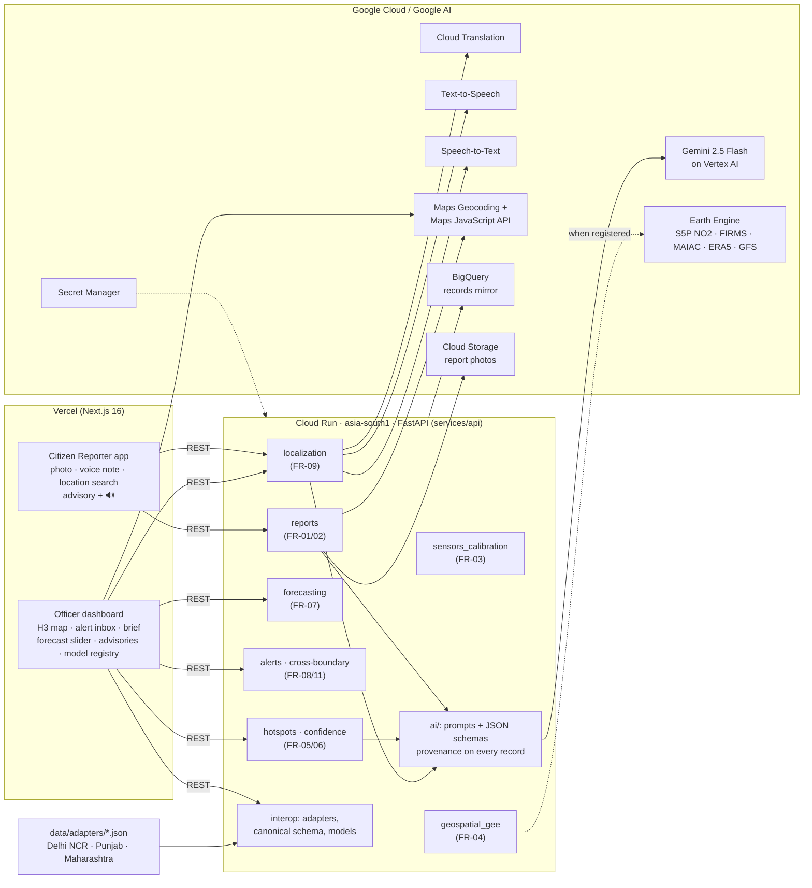

# VayuDrishti: federated hyper-local air-quality intelligence

**VayuDrishti turns a citizen's photo into an officer's action.** Gemini checks the photo and fuses it with
calibrated low-cost sensors, satellite and weather signals on a 1 km H3 grid. The result is a transparent
*Hotspot Confidence* score, a likely source and an evidence-grounded action brief. The alert reaches the
responsible jurisdiction within seconds, and health advisories go out in English, Hindi and Punjabi with voice.
One canonical schema and per-state adapters let Delhi NCR, Punjab and Maharashtra share models and send each
other cross-boundary alerts.

Build with AI (Google) hackathon, Track 2 · Full spec: [docs/PRD.md](docs/PRD.md) · Submission pack:
[docs/SUBMISSION.md](docs/SUBMISSION.md) · Pitch deck: [docs/pitch/VayuDrishti_Spontom_Pitch.pptx](docs/pitch/VayuDrishti_Spontom_Pitch.pptx) ([PDF](docs/pitch/VayuDrishti_Spontom_Pitch.pdf))

## Live prototype

| Component | URL | Hosting |
|---|---|---|
| API (FastAPI, `/docs` for OpenAPI) | https://air-quality-network-api-847963771142.asia-south1.run.app | Cloud Run, asia-south1 |
| Citizen Reporter app | _to be filled by lead_ | Vercel |
| Environmental Officer dashboard | _to be filled by lead_ | Vercel |

Health check: `GET /health`. Which integrations are live right now: `GET /api/config` (also the badge in the
header of both apps).

## Core journey (PRD §8, §57)

```text
Citizen Photo → Gemini Verification → Sensor + Satellite + Weather on Grid → Hotspot Confidence
  → Likely Source + Action Brief → Officer Alert (human approval) → Multilingual voice advisory
  → Cross-boundary alert + shared model (Punjab → Delhi NCR)
```

**Hotspot Confidence** = sensor anomaly 35 % · satellite 25 % · citizen reports 25 % · weather plausibility 15 %.
**Roles:** Citizen Reporter (`apps/citizen-web`) and Environmental Officer (`apps/officer-dashboard`).

## Architecture



Domain services start as modules inside one FastAPI service (`services/api/app/<domain>/`). They match the
`services/*/README.md` folders and can be split into separate Cloud Run services later without API changes.

## Google AI integration map

| Where in the journey | Google technology | What it does | Code | Status in production |
|---|---|---|---|---|
| Citizen photo check (FR-02) | **Gemini 2.5 Flash (multimodal) on Vertex AI** | Classifies the event, source type, severity, indicators and confidence. Flags irrelevant or poor images | `app/ai/services.py::verify_photo`, `ai/prompts/photo_verification_v1.md` | **Live** |
| Action brief (FR-06/08) | **Gemini** (structured JSON) | Likely sources, evidence with source + time, recommended inspections drawn only from the jurisdiction's action rules, uncertainties. Numbers are checked against the evidence bundle | `app/ai/services.py::action_brief`, `ai/prompts/action_brief_v2.md` | **Live** |
| Health advisory (FR-09) | **Gemini** + **Cloud Translation** | Advisory from forecast + local PM2.5, translated to Hindi and Punjabi | `health_advisory_v1.md`, `app/localization/google_cloud.py` | **Live** |
| Voice (FR-09) | **Cloud Text-to-Speech** / **Speech-to-Text** | Spoken advisory (en/hi/pa-IN). Citizens can dictate the report description | `/api/text-to-speech`, `/api/speech-to-text` | **Live** |
| Location (FR-01) | **Maps Geocoding API**, **Maps JavaScript API** | Address confirmation, locality search, hotspot map | `app/geo/maps.py`, `hex-map.tsx` | **Live** (map: once the key allows the Vercel domain) |
| Analytics | **BigQuery** | Every report, hotspot, alert, advisory and observation, append-only | `app/core/store.py` | **Live** |
| Evidence storage | **Cloud Storage** | Citizen photos | `app/reports/storage.py` | **Live** |
| Satellite + weather (FR-04) | **Earth Engine** | Sentinel-5P NO2, FIRMS fires, MAIAC AOD, ERA5-Land, GFS → H3 res 8 | `app/geospatial_gee/earth_engine.py` | Written; sample extracts until EE registration |
| Forecast + model registry (FR-07/11) | Vertex AI Model Registry (target) | Shared `igp-smog-forecast-v1` reused by Delhi NCR and Punjab | `app/forecasting/model.py`, `app/models_registry/` | Local registry with model cards |
| Real-time updates / auth | Firebase | Operational mirror | `app/core/store.py` | Written; off until Firebase is added |

Every AI record stores `model_name`, `model_version`, `prompt_version` and `generated_at`. Gemini only sees
structured evidence (observed data → AI interpretation → recommendation) and never invents measurements.

## Run locally

Prerequisites: Node 20+, pnpm 11, Python 3.12, [uv](https://docs.astral.sh/uv/).

```bash
cp .env.example .env                                   # fill in what you have; empty = demo mode
for a in apps/*; do cp $a/.env.example $a/.env.local; done
pnpm install
(cd services/api && uv sync)

pnpm dev:api                 # http://localhost:8020  (OpenAPI docs at /docs)
pnpm dev:citizen-web         # http://localhost:3020
pnpm dev:officer-dashboard   # http://localhost:3021
```

Checks: `pnpm test:api` (always runs in demo mode), `pnpm lint`, `pnpm build`.
Each app also builds on its own: `cd apps/citizen-web && pnpm install && pnpm build`. The app folder has its
own lockfile for Vercel, see [infrastructure/vercel/README.md](infrastructure/vercel/README.md).

API in Docker (build context = repo root, because the API reads `ai/` and `data/` at runtime):

```bash
docker build -f services/api/Dockerfile -t air-quality-network-api .
docker run --rm -p 8080:8080 -e FORCE_DEMO_MODE=true air-quality-network-api
```

## Environment variables

API (`.env` locally; Cloud Run values are set by `infrastructure/cloud-run/deploy.sh`):

| Variable | Purpose | Production value / source |
|---|---|---|
| `GOOGLE_CLOUD_PROJECT` | GCP project for Vertex AI, BigQuery, ADC-based calls | `spontom-build-with-ai` |
| `GOOGLE_GENAI_USE_VERTEXAI` | `true` = Gemini through Vertex AI with the service account | `true` |
| `GOOGLE_CLOUD_LOCATION` | Vertex AI location for Gemini | `global` |
| `GEMINI_MODEL` | Gemini model id | `gemini-2.5-flash` |
| `GEMINI_API_KEY` | Only for AI Studio mode (not used in production) | unset |
| `GOOGLE_CLOUD_API_KEY` | Speech-to-Text, Text-to-Speech, Translation. **Not** `GOOGLE_API_KEY`, which google-genai would read as a Gemini key and which breaks Vertex mode | Secret Manager `google-api-key` |
| `MAPS_API_KEY` | Server-side Geocoding | Secret Manager `maps-api-key` |
| `BIGQUERY_DATASET` | Analytics mirror dataset (table `records`, see `infrastructure/bigquery/schema.sql`) | `air_quality_network` |
| `GCS_BUCKET` | Report photos (prefix `air-quality-network/reports/`) | `spontom-build-with-ai-media` |
| `GOOGLE_APPLICATION_CREDENTIALS` | Service-account JSON, **local dev only** | Cloud Run uses its service account |
| `EARTH_ENGINE_PROJECT` | Enables Earth Engine layers | unset (registration pending) |
| `FIREBASE_PROJECT_ID` | Enables Firestore mirror | unset (Firebase not added yet) |
| `DATA_GOV_IN_API_KEY` | CPCB real-time station data | unset |
| `SENSOR_INGEST_TOKEN` | Shared secret for `POST /api/sensors/{id}/observations` (`X-Ingest-Token`) | optional |
| `CORS_ORIGINS` | Comma-separated allowed browser origins | the two Vercel URLs |
| `CORS_ORIGIN_REGEX` | Extra allowed origins as a regex (preview deploys) | `https://.*\.vercel\.app` |
| `FORCE_DEMO_MODE` | `true` = ignore every key and use sample data + AI fixtures (tests) | `false` |

Apps (`apps/*/.env.local`; set in Vercel for production):

| Variable | App | Purpose |
|---|---|---|
| `NEXT_PUBLIC_API_URL` | both | API base URL, e.g. the Cloud Run URL above |
| `NEXT_PUBLIC_MAPS_API_KEY` | officer | Browser Maps JavaScript key (HTTP-referrer restricted). Empty or rejected → Leaflet + OSM |

## Demo mode: honest by design

Each integration sits behind a small adapter. It is used for real when its variables are set. Otherwise it
falls back to clearly labelled sample data, and a failed real call also falls back. `GET /api/config` reports
each integration as `real`, `demo` or `fallback`, with the last error. The header badge in both apps shows
this. In production today it reads **"N/M live · rest sample data"**. Click it to see what is live (Gemini,
Translation, TTS, STT, Maps, BigQuery, Cloud Storage) and what is sample (Earth Engine layers, CPCB station,
low-cost sensor feeds, Firestore, Vertex AI Model Registry).

- Sample files carry `source`, `reference_timestamp`, `dataset_version`, `geographic_scope`, `is_sample`, and
  the UI labels them (for example "sample / simulated data", "indicative" for low-cost sensors).
- Sample citizen photos are real CC-licensed photographs (credits in [THIRD_PARTY.md](THIRD_PARTY.md)). In live
  mode Gemini really analyses them. In demo mode a stored fixture result is used, matched by SHA-256.
- With no keys at all, the whole journey still runs end to end, including templated briefs and pre-written
  hi/pa advisories.

## State onboarding story (PRD §40)

A new city or state is a configuration, not a code change:

1. **Register** it in `data/adapters/<state>.json`: jurisdiction (id, name, district = the officer inbox),
   centre and corridor, languages, hotspot threshold and fast-path rule.
2. **Map local fields** to the canonical schema: `sensor_feed.field_map` + timestamp format/timezone. Punjab's
   vendor feed (`device`, `time_ist`, `PM2_5`, `HUM`, `dd-mm-YYYY HH:MM` IST), Delhi's (`sensor_id`, `ts`,
   `pm25`, `rh`) and Maharashtra's (`id`, `timestamp_utc`, `pm2_5_ugm3`, UTC) all land in
   `data/schemas/canonical_cell_snapshot.schema.json` (`GET /api/cells/{id}`).
3. **Validate**: `pnpm test:api` runs the adapter tests. Every record keeps its source and timestamp.
4. **Configure action rules** (the only actions Gemini may recommend) and advisory languages.
5. **Select or fine-tune a shared model**: Punjab reuses Delhi NCR's `igp-smog-forecast-v1` with its own offset.
   Maharashtra uses a persistence baseline and a different threshold (65). Each has a model card and MAE against
   persistence (`GET /api/models`).
6. **Declare cross-boundary neighbours**, e.g. Punjab → Delhi NCR downwind, so a crop-burning hotspot can
   raise an officer-approved alert in the neighbour's inbox.

Satellite and weather layers cover every Indian district from day one (Earth Engine), before any local sensor
is connected. The same pattern works across borders (for example with BRICS partner cities): a new adapter
and language pack, same schema and models.

## 5-minute demo (PRD §44)

The timed, scene-by-scene script against the live URLs is in [docs/SUBMISSION.md](docs/SUBMISSION.md).
Use *Reset demo* on the dashboard (or `POST /api/demo/reset`) to start again.

## How it works

- **Grid**: H3 resolution 8 (~1 km), 37 cells per demo area. Each cell fuses calibrated low-cost sensors (IDW
  within 1.2 km, labelled *indicative*), the nearest official station (expected level), satellite NO2 / AOD /
  upwind fires, weather, land use and verified citizen reports.
- **Hotspot Confidence** (`app/hotspots/confidence.py`): transparent 0–100 per factor, weighted 35/25/25/15.
  Connected cells at or above the configured threshold become a hotspot. A fast path covers severe, clearly
  visible reports.
- **Action brief**: Gemini gets only the evidence bundle and the jurisdiction's action rules. Output is
  schema-validated. Actions outside the rules are dropped, and numbers not found in the bundle are flagged as
  validation warnings.
- **Human approval**: alerts start as `pending_review`. Acknowledging approves the selected actions, then the
  officer records the action and closes the alert. Cross-boundary transfers and public advisories each need an
  explicit officer approval.
- **Forecast**: `igp-smog-forecast-v1`, a per-horizon linear model on standardised features. It is pooled over
  Delhi NCR and Punjab, fine-tuned per configuration, and backtested against persistence on 20 held-out days.

## Deployment

- API: `CORS_ORIGINS=... CORS_ORIGIN_REGEX='https://.*\.vercel\.app' infrastructure/cloud-run/deploy.sh api`.
  This stages only `services/api`, `ai/` and `data/`, builds with Cloud Build and deploys with the
  `hackathon-dev` service account and Secret Manager keys. `DRY_RUN=1` builds the same image locally instead.
- Apps: Vercel, one project per app folder. See [infrastructure/vercel/README.md](infrastructure/vercel/README.md).
- The MVP keeps its operational state in an in-process JSON store, mirrored to BigQuery and GCS. The API
  therefore runs as one warm instance (`min = max = 1`). Scaling out means switching the store to Firestore,
  which is already wired.

## Known gaps

- Earth Engine, CPCB and Firestore paths are written but run on labelled sample data in production (Earth
  Engine registration, a data.gov.in key and Firebase are pending). The CPCB client is unit-tested with a
  mocked transport.
- The forecast model is trained on simulated histories, so its accuracy numbers only demonstrate the method.
  Vertex AI Model Registry is not wired; the registry is local with model cards.
- Land-use labels are synthetic. Boundary-layer height is missing from ERA5-Land/GFS, so the ventilation
  index is a labelled proxy.
- No login or role enforcement yet: the two roles are separate apps. Alerts go to the dashboard only, with no
  SMS or email.

## Layout

| Path | Purpose |
|---|---|
| `apps/citizen-web/` | Citizen Reporter app (Next.js) |
| `apps/officer-dashboard/` | Environmental Officer dashboard (Next.js) |
| `services/api/` | FastAPI gateway; domain modules under `app/` |
| `services/*/README.md` | Domain service boundaries (reports, sensors-calibration, geospatial-gee, hotspots, forecasting, alerts, localization) |
| `ai/` | Versioned prompts and JSON schemas |
| `data/` | Canonical schema, state adapters, labelled sample data, sample generator |
| `infrastructure/` | Cloud Run deploy script, Vercel settings, BigQuery schema, Firebase placeholder |
| `docs/` | PRD, submission pack, pitch deck |
